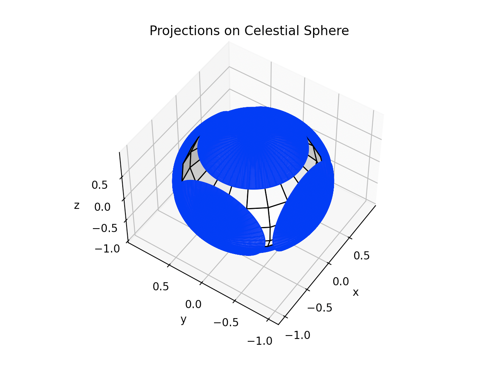
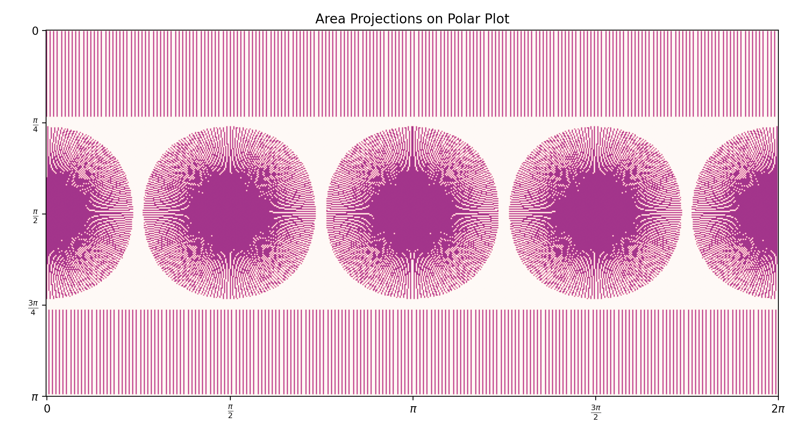
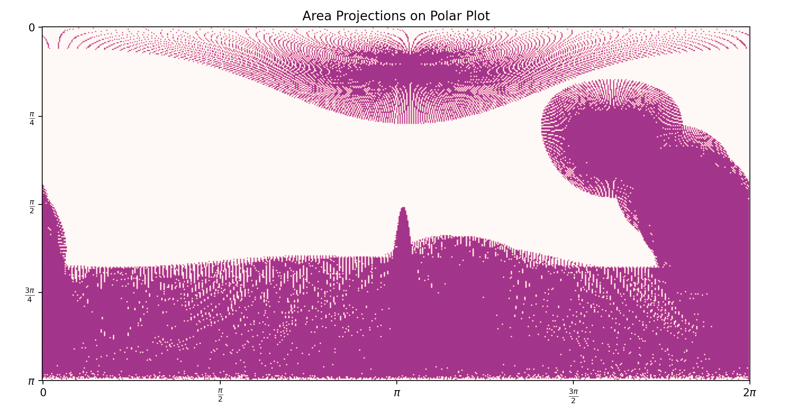

# Sensors

## Sensor Placement

One of the fundamental design decisions for Attitude Control Systems is to determine where sensors will be placed on the satellite bus. Their pose (position and attitude) must ensure "adequate performance" for the various satellite operational modes. This performance can mean either enough field-of-view (FOV) coverage for measurement (i.e., sun sensors) or maintaining exclusion angles to reduce disturbances from celestial bodies (i.e., star trackers). In broad terms, sensor placement must consider:

- Quasi-Inertial Attitudes (Inertial Pointing)
   1. Multi-sensor field of View (FOV) coverage
   1. Obscuration due to satellite components (antennas, panels, instruments)

- Dynamic Attitudes (Nadir Pointing, Pushbroom Pointing, Target Tracking)
   1. Satellite operational mode trajectories
   1. Relative motion of relevant celestial bodies (i.e., Sun/Moon)

The considerations are broken down into the type of operational attitudes. For quasi-inertial attitudes (i.e., inertial pointing), one can hold the satellite fixed and determine FOVs. CAD applications are a common tool for doing this sort of analysis. 

Most attitudes are **not** quasi-inertial. For example, nadir pointing requires the satellite to track an angular velocity equal to 2π divided by the orbital period (i.e., the satellite rotates at the same rate as its orbital angular frequency). CAD applications are insufficient for this type of analysis because you need to *jointly* evaluate the satellite pose and the ephemerides of the celestial bodies. The following two examples show how `ACS Toolbox` is able to carry out these complex analyses.

### Example 1: Quasi-Static Sensor Placement

We have an inertial pointing mission which points towards a set of "fixed" stars with the attitude `q = [0.707 0.0 0.0 0.707]` &#7488;. The satellite bus is in the shape of a rectangular prism with a single sun sensor on each of the 6 body panels. Each sun sensor has a conical half-angle field of view of `42.2 deg` and is oriented so that its boresight is aligned with its panel normal. There are no antennas or additional panels which obscure the FOV of the sensors. What is our satellite combined FOV coverage?

```python
import numpy as np
from acstoolbox.sensors import placement

# Conical half angle FOV in [deg]
half_angle_fov_deg = 47.2

# Boresights aligned with (+x, +y, +z, -x, -y, -z) panel normals
panel_normal_list = [np.array([1,0,0]), np.array([0,1,0]), np.array([0,0,1]),
                     np.array([-1,0,0]), np.array([0,-1,0]), np.array([0,0,-1])]

# Purely conical FOVs can be treated as exclusion areas.
# Discretize the spherical coordinates between [0,2pi] and [0,pi] into 20 slices
for normal in panel_normal_list:
    sphere.conical_exclusion_area(normal, half_angle_fov_deg, 20j)

# Render the celestial sphere showing the sensor FOVs.
sphere.celestialplot()

# Render the FOV coverage in polar coordinates.
sphere.polarplot()
```
Rendering the sensor FOVs (in blue) on a celestial sphere allow us to see the overlaps and gaps in sensor coverage. Sensors with `42.2 deg` FOV unfortunatley do not have 4π steradians coverage.



In many situations, it is easier to view in polar coordinates.




### Example 2: Dynamic Sensor Placement

We have a satellite which has an optical instrument whose boresight is aligned to the body `-z` axis. The payload opertional mode uses a star tracker to point the instrument (boresight) at the center of the Earth while minimizing the angle between the +x panel and the Sun. The manufacturer has indicated that the star tracker boresight must be kept at least `30 deg` away from the sun and `60 deg` away from the center of the Earth. The satellite orbit is similar to an already orbiting satellite whose TLE is available. A very representative payload operational period is between `12h00m00s January 1, 2018` and `12h00m10s January 1, 2018`.

Where can the star tracker be placed on the satellite so as to not corrupt its measurements during payload operations?

```python
# Scenario start and end Gregorian timestamps.
t_start_UTC = [2018, 1, 1, 12, 0, 0]
t_end_UTC = [2018, 1, 1, 12, 0, 10]

# Timestep between subsequent evaluations.
dt_s = 1

# Set up the trajectory generator to Point the payload boresight (-z axis)
# to the target, while constraining about the the +x axis.
p_b = np.array([0,0,-1])`
s_b = np.array([1,0,0])
trajectory = trajectory.AlignConstrained(p_b, s_b)`

# Initialize clock and convert UTC Gregorian timestamps into
# Julian seconds from J2000.
clock = time.Clock()`
js_j2000_t_start_UTC = clock.GregoriantoJSJ2000(t_start_UTC)
js_j2000_t_end_UTC = clock.GregoriantoJSJ2000(t_end_UTC)

# Initialize sun ephemeris using the clock.
sun = sunephemeris.Sun(clock)

# Set up SGP4 propagator.
tle_filepath = 'tle.txt'
tle_param = tle.TLEParametersFromFile(tle_filepath, 1900)
sgp4 = tle.SGP4(tle_param)

# Discretize evaluation timestamps.
scenario_js_j2000s_UTC = np.arange(js_j2000_t_start_UTC, js_j2000_t_end_UTC, dt_s)`

# At each timestamp generate the satellite trajectory and project
# the exclusion areas.
R = [], S = []
for js_j2000_scene_UTC in scenario_js_j2000s_UTC:
    # Unit sun vector expressed in an approximate inertial (MOD) frame.
    s_i = sun.GetMODFromJSJ2000UTC(js_j2000_scene_UTC)
    s_i = s_i/np.linalg.norm(s_i)

    # Earth from orbit position evaluated using TLE.
    dt_min = (js_j2000_scene_UTC - tle_param['epoch_jsj2000_utc'])/60.0
    rv_MOD = sgp4.GetOrbitState(dt_min)
    r_i = -rv_MOD[0]/np.linalg.norm(rv_MOD[0])

    # Satellite trajectory which aligns the payload boresight with the Earth
    # center and subsequently constrains the attitude by aligning the +x
    # axis towards the Sun.
    C_bi = trajectory.Attitude(r_i, s_i)

    # Express the Earth and Sun in the satellite body frame.
    R.append(C_bi.dot(r_i))
    S.append(C_bi.dot(s_i))

# Project the Earth and Sun as conical exclusion areas.
sphere = p.CelestialSphere(0.9, "k")
earth_half_angle_fov_deg = 60.0
sun_half_angle_fov_deg = 30.0
for r_b in R:
    sphere.conical_exclusion_area(r_b, earth_half_angle_fov_deg, 200j)
for s_b in S:
    sphere.conical_exclusion_area(s_b, sun_half_angle_fov_deg, 200j)

# Render the exclusion areas in polar coordinates.
sphere.polarplot()

```

In many situations, it is less computationally intensive to view the exclusion areas in polar coordinates. Doing so, shows us all the candidate areas where neither the Earth nor the Sun corrupt our star tracker operation. These spherical coordiantes can be converted back to Cartesian coordinates when finalizing the sensor placement.


